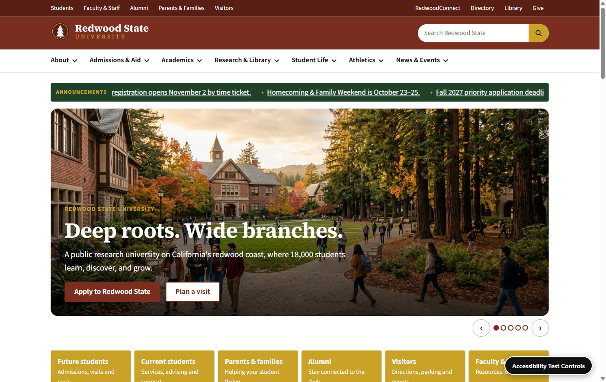

# Redwood State University



An accessibility testing fixture disguised as a university website. Redwood State University, its
people, places, and news are entirely fictional (see [`docs/WORLD.md`](docs/WORLD.md)) — this is not a
real institution. The site exists so accessibility tools (WAVE, axe, screen readers, keyboard-only
testing) have a large, realistic surface with **known, registered defects** to find, each independently
toggleable between its broken and fixed form. See [`docs/ACCESSIBILITY_TESTING.md`](docs/ACCESSIBILITY_TESTING.md)
for how the toggle system works and how to run each kind of test.

210 routes across a public university site, a student portal, and an Accessibility Lab reference section
([`docs/SITE_MAP.md`](docs/SITE_MAP.md), generated from the route inventory).

## Tech stack

- **React 19 + TypeScript**, **React Router v8** in framework mode with `ssr: false` and `prerender` — every
  route is written to a static `index.html` at build time, so the whole site opens on any static host with
  no server, and scanners see real HTML before JavaScript runs.
- **Vite** for the build.
- Plain CSS (one base layer + one stylesheet per section) — no CSS framework, so nothing masks the
  intentional defects.
- **MiniSearch** for the client-side search index.
- **Vitest** + Testing Library for unit/component tests; **Playwright** + `@axe-core/playwright` for
  end-to-end and accessibility tests.
- Photos and illustrations generated with **Nano Banana in Google Flow**; the logo and seal are hand-built
  SVG.

## Getting started

```
npm ci                 # install
npm run dev             # local dev server
npm run build           # writes build/client (static site)
npm run preview          # serves build/client on :4173
npm test                  # unit/component tests (Vitest)
npm run build && npm run test:e2e   # Playwright + axe end-to-end tests, against the build
```

Playwright's `webServer` (configured in `playwright.config.ts`) serves `build/client` on port 4319 for the
e2e run; it expects `npm run build` to have already produced it.

Other useful scripts: `npm run lint`, `npm run typecheck`, `npm run check:scenarios` (every registered
defect renders where it says it does), `npm run coverage` (every rule used, every coverage area has enough
instances), `npm run scan -- /some/path` (prints an axe before/after table for one page — see
`docs/ACCESSIBILITY_TESTING.md`).

## Deploying

Every route is prerendered to its own static HTML file, so no host-side routing is needed for known paths
— only a fallback for unknown ones (`404.html`, written automatically by the build).

| Host | Setup |
|---|---|
| **Cloudflare Pages** | Build command `npm run build`, output directory `build/client`. |
| **Netlify** | Same, plus the committed `public/_redirects` (`/* /404.html 404`) is copied into the output automatically. |
| **Vercel** | `vercel.json` at the repo root sets the build command and `build/client` as the output directory. |
| **GitHub Pages** | `.github/workflows/deploy-pages.yml` builds with `BASE_PATH=/a11y_university/` and deploys `build/client` on every push to `main` (or manually via workflow dispatch). |

`public/robots.txt` and a `<meta name="robots" content="noindex">` on every page keep search engines from
indexing the site — it should never be mistaken for a real university. The footer also carries a plain-text
"fictional institution / accessibility testing fixture" notice.
